# 🏥 Assistant Home: Sistema Multiagente de Asistencia Domiciliaria


> **Proyecto de Sistemas Inteligentes (SI-31)** > Una simulación avanzada de Inteligencia Ambiental donde agentes autónomos (BDI) gestionan el cuidado de una persona dependiente, controlan el stock de medicamentos y optimizan el consumo energético en un entorno domótico.

---

## 📑 Tabla de Contenidos
1. [Descripción General](#-descripción-general)
2. [Los Agentes (Personajes)](#-los-agentes-personajes)
3. [Simulación y Entorno](#-simulación-y-entorno)
4. [Objetos Interactivos](#-objetos-interactivos-y-recursos)
5. [Arquitectura del Sistema](#-arquitectura-del-sistema)
6. [Lógica Detallada de los Agentes](#-lógica-detallada-de-los-agentes)
7. [Instalación y Ejecución](#-instalación-y-ejecución)
8. [Autores](#-autores)

---

## 📋 Descripción General

Este proyecto implementa un sistema Multiagente (MAS) utilizando **Jason** (basado en AgentSpeak) y **Java/CArtAgO**. El sistema simula la vida diaria en una casa inteligente donde interactúan:
* Un **paciente humano** con rutinas de vida y necesidades médicas.
* Un **equipo robótico** encargado de su salud y el mantenimiento del hogar.
* Un **proveedor externo** (supermercado) para la logística.

El sistema resuelve problemas complejos como la **navegación autónoma (A*)**, la **gestión de conflictos** por recursos compartidos, el control de **batería** y la **caducidad de productos**.

---

## 👥 Los Agentes (Personajes)

El sistema se compone de 4 agentes inteligentes, cada uno con roles, creencias y objetivos específicos.

| Agente | Avatar | Rol y Responsabilidades |
| :---: | :---: | :--- |
| **OWNER** |  | **El Paciente.** Simula comportamiento humano: duerme, ve la TV, bebe cerveza y tiene pautas de medicación. Puede tomar la medicina por sí mismo o esperar a que se la traigan. |
| **ROBOT** |  | **La Enfermera.** Es el coordinador principal. Monitoriza la salud del Owner, gestiona el horario de medicinas, realiza entregas y verifica que el paciente se tome las dosis. |
| **AUXILIAR** |  | **El Soporte.** Robot de carga pesada. Se encarga de reponer el stock caducado o agotado contactando al Supermercado. Además, **transfiere energía** a la Enfermera si esta se queda sin batería. |
| **SUPERMARKET**| 🛒 | **El Proveedor.** Entidad externa que recibe pedidos de medicamentos o cerveza y realiza entregas en el punto de recogida de la casa. |

---

## 🏠 Simulación y Entorno

El entorno (`HouseEnv`) es una cuadrícula que representa la vivienda completa.

### 📸 Vista de la Simulación
La interfaz gráfica muestra el movimiento en tiempo real, el estado del inventario y los niveles de energía de los robots.

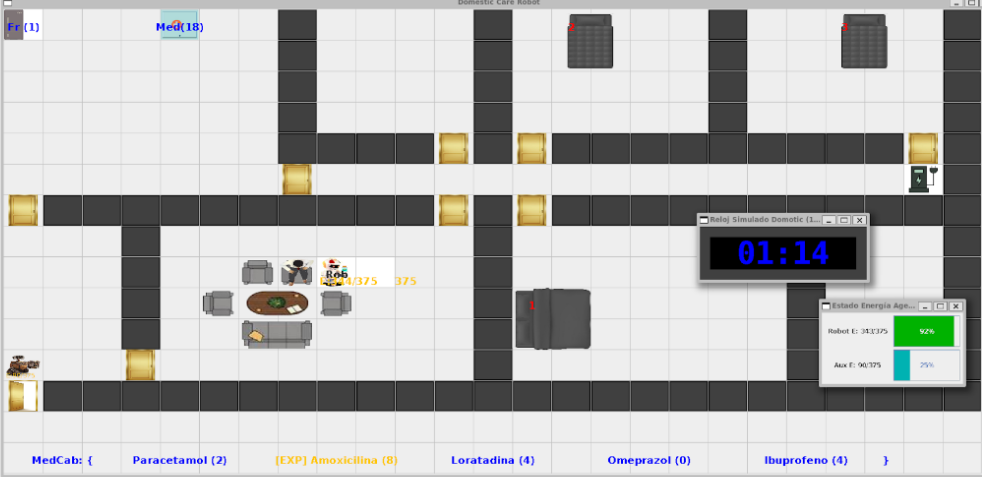

### 🧩 Percepciones
Los agentes reciben percepciones específicas según su ubicación (sensores) y actúan sobre el entorno (actuadores).

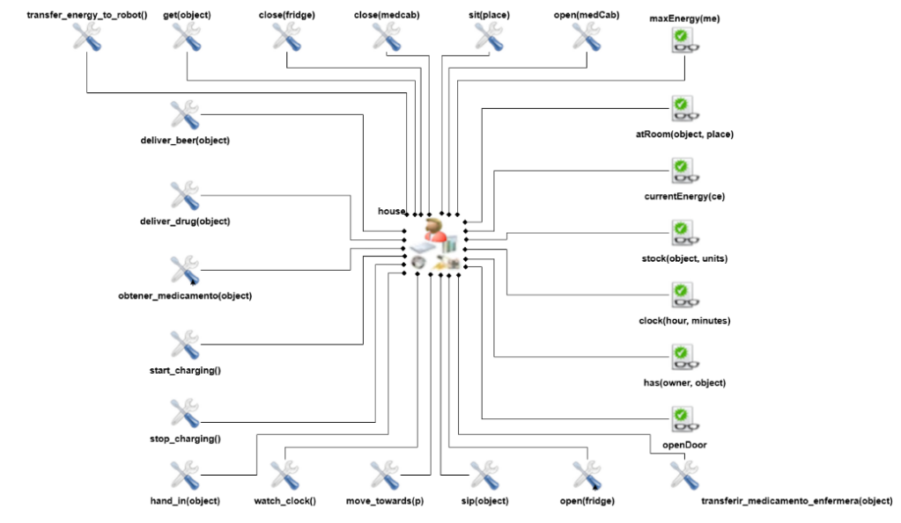

---

## 🔌 Objetos Interactivos y Recursos

Los agentes interactúan con objetos inteligentes distribuidos por la casa. Estos "Artefactos" son esenciales para la supervivencia de los robots y la salud del paciente.

| Objeto | Imagen | Función y Características |
| :---: | :---: | :--- |
| **Nevera Inteligente** |  | **Almacén de Suministros.** Guarda tanto cervezas como ciertos medicamentos que requieren frío. Los agentes pueden `open()` y `get()` productos. Controla el stock automáticamente. |
| **Cajón de Medicinas** |  | **Farmacia Doméstica.** Ubicado en la cocina. Es el punto crítico donde el Robot busca las dosis. El Auxiliar monitoriza las **fechas de caducidad** de su contenido para reponerlo antes de que expire. |
| **Punto de Carga** |  | **Estación de Energía.** Ubicado al final del pasillo (23, 5). Es un recurso compartido: solo un robot puede cargar a la vez. Si está ocupado, el otro debe esperar su turno o pedir transferencia de energía. |
| **Zonas de Descanso** |  <br>  | **Interacción Humana.** El Owner utiliza estos objetos (sofá y camas) para realizar sus rutinas diarias (dormir, ver TV, descansar) mientras espera su medicación. |

---

## 🏗️ Arquitectura del Sistema

### Organización y Colaboración
Los agentes no trabajan aislados. Existe una estructura organizativa para cumplir la misión crítica: `Getting Drug` (Asegurar la medicación).

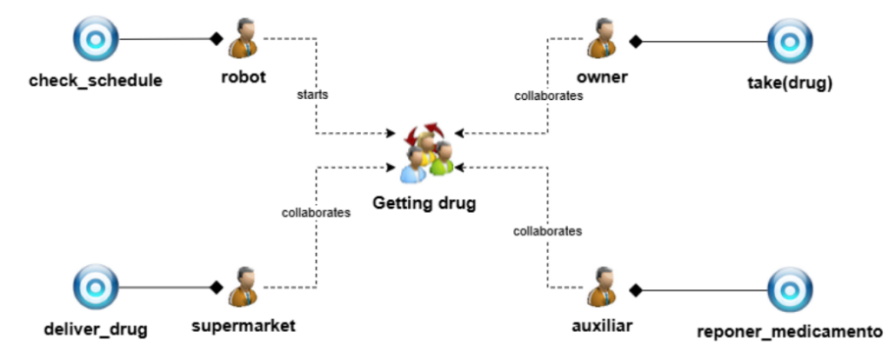
*Figura: El Robot inicia la tarea, el Auxiliar apoya en logística y el Owner colabora consumiendo.*

### Objetivos BDI
El árbol de objetivos muestra cómo se descompone la meta principal en sub-metas manejables.

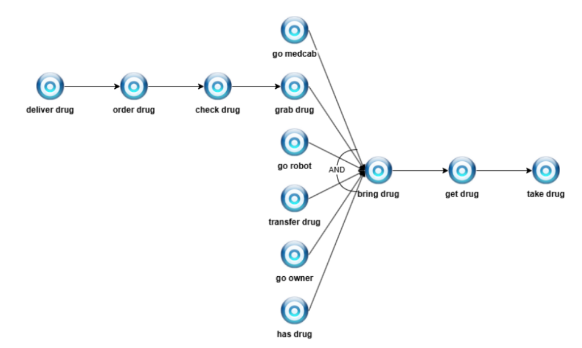
*Figura: Descomposición de objetivos. Si no hay medicina -> pedirla (`order drug`). Si hay -> cogerla (`grab`) y entregarla (`bring`).*

### Interacción y Mensajería
Diagrama de secuencia que muestra el protocolo de comunicación (KQML) entre agentes.

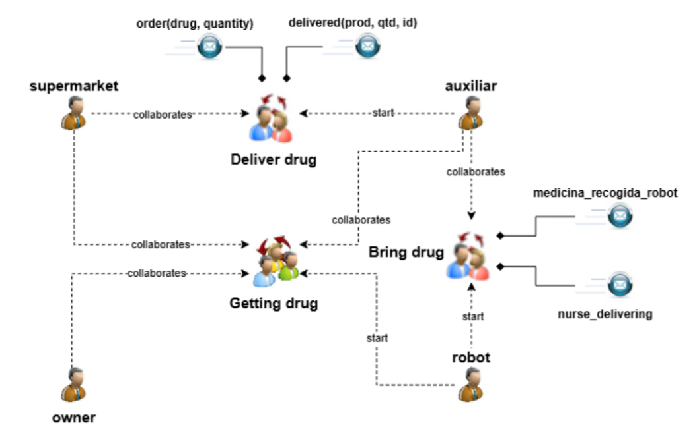
*Figura: Flujo de mensajes para coordinar una entrega de medicina y reposición de stock.*

---

## 🧠 Lógica Detallada de los Agentes

A continuación se detallan los diagramas de tareas (planes) que definen la "inteligencia" de cada agente. Los diagramas grandes se han dividido en dos partes para mayor detalle.

### 1. Lógica del OWNER
El Owner tiene libre albedrío simulado. Puede decidir cooperar con el robot o actuar por su cuenta ("competir" por la medicina).

| Diagrama General del Agente | Árbol de Tareas (Planes) |
| :---: | :---: |
| 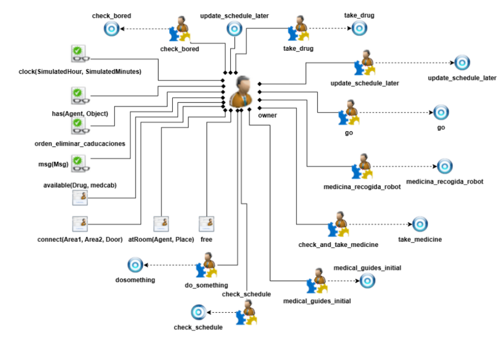 | **Parte 1:**<br>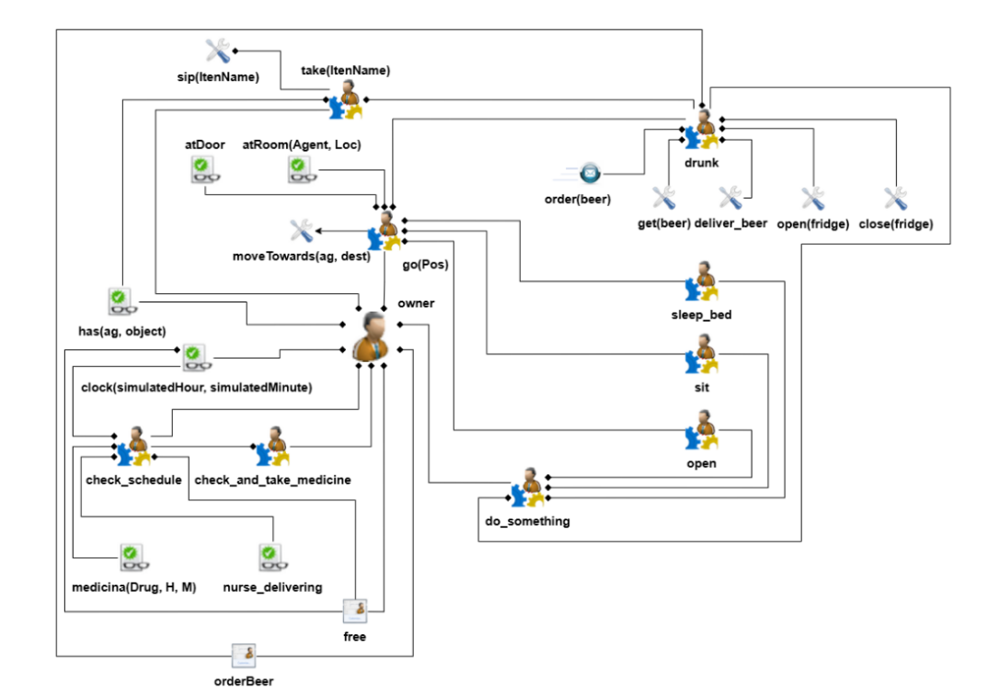<br>⬇️<br>**Parte 2:**<br>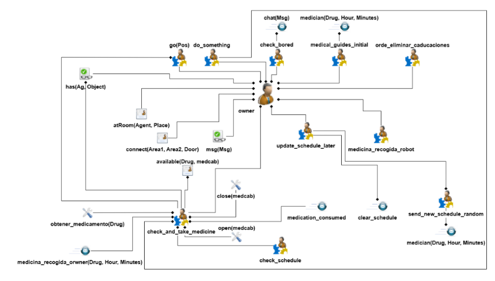 |

---

### 2. Lógica del ROBOT (Enfermera)
Es el agente más complejo. Debe equilibrar la atención al paciente con su propia supervivencia (batería).
* **Verificación:** No confía ciegamente. Si el Owner dice "ya me la tomé", el robot va al botiquín a comprobar el stock.
* **Gestión de Energía:** Si la batería baja, busca el cargador. Si está ocupado o no llega, pide auxilio al Auxiliar.

| Diagrama General del Agente | Árbol de Tareas (Planes) |
| :---: | :---: |
| 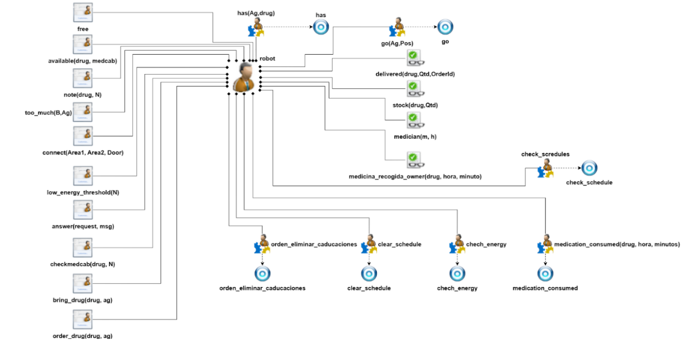 | **Parte 1:**<br>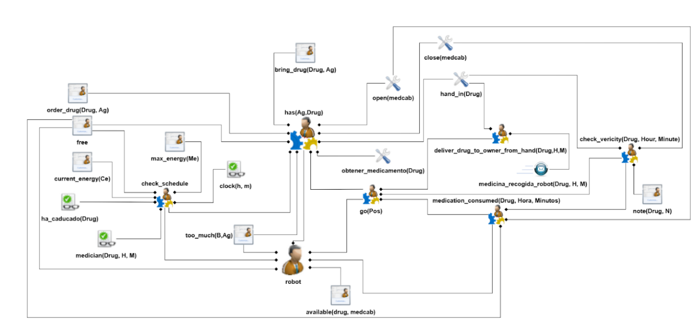<br>⬇️<br>**Parte 2:**<br>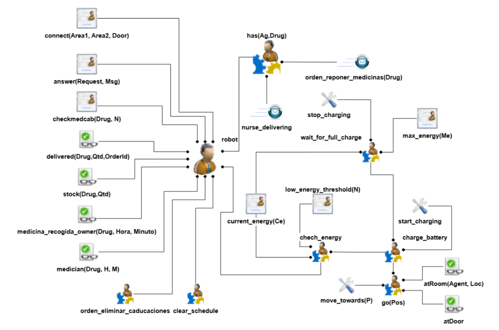 |

---

### 3. Lógica del AUXILIAR
Actúa reactivamente a las necesidades de la casa.
* **Control de Caducidad:** Revisa periódicamente las fechas de los medicamentos. Si algo caduca, lo retira y pide recambio.
* **Soporte Energético:** Actúa como "Power Bank" móvil para la Enfermera.

| Diagrama General del Agente | Árbol de Tareas (Planes) |
| :---: | :---: |
|  | **Parte 1:**<br>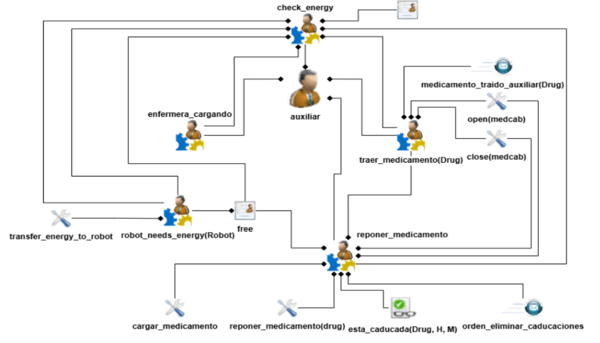<br>⬇️<br>**Parte 2:**<br>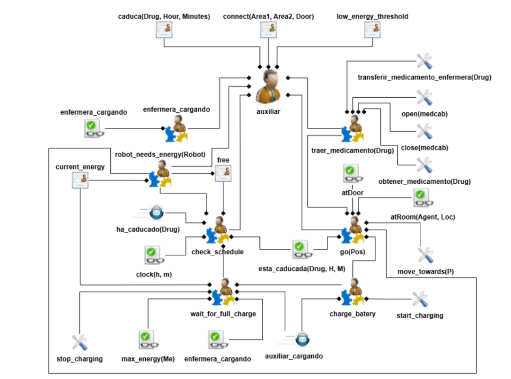 |

---

### 4. Lógica del SUPERMARKET
Agente simple reactivo que espera pedidos (`order`) y confirma entregas (`delivered`).

| Diagrama General del Agente | Árbol de Tareas (Planes) |
| :---: | :---: |
|  | 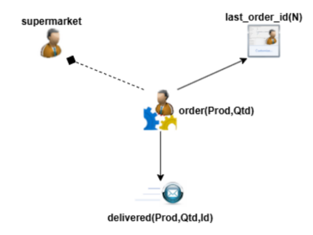 |

---

## ⚡ Gestión de Energía y Tiempo

El sistema incluye mecanismos avanzados de simulación:

1.  **Reloj Simulado:** El tiempo avanza más rápido que en la realidad (30 seg reales = 1 hora simulada) para ver ciclos completos de día/noche.
    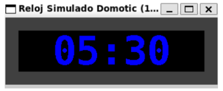

2.  **Batería:** Los robots consumen energía al moverse. Deben gestionar sus ciclos de carga para no quedarse "muertos" en un pasillo.
    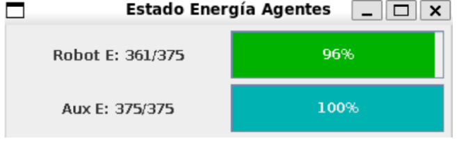

---

## 🚀 Instalación y Ejecución

### Prerrequisitos
* **Java JDK 8** o superior.
* **Gradle** (incluido en el wrapper).

### Pasos
1.  **Clonar el repositorio:**
    ```bash
    git clone https://github.com/lKubi/SI-Project.git
    ```

2.  **Compilar y Ejecutar:**
    Utiliza el wrapper de Gradle para arrancar la simulación Jason + CArtAgO.
    ```bash
    ./gradlew run
    ```
    *(En Windows usa `gradlew.bat run`)*

3.  **Interfaz:**
    Se abrirá automáticamente la ventana `MAS Console` (logs de los agentes) y la ventana gráfica de la casa (`HouseView`).

---

## ✒️ Autores

Este proyecto ha sido desarrollado por el equipo **SI-31** para la asignatura de Sistemas Inteligentes de la **Universidad de Vigo**:

* **Miguel Ángel Seara Losada**
* **David Simón Nóvoa**
* **Mauro Zelenka Pedrosa**
* **Luis Fernando Pérez Moure**

---

> *Este proyecto utiliza la plataforma [Jason](http://jason.sourceforge.net/) para el desarrollo de sistemas multiagente.*
